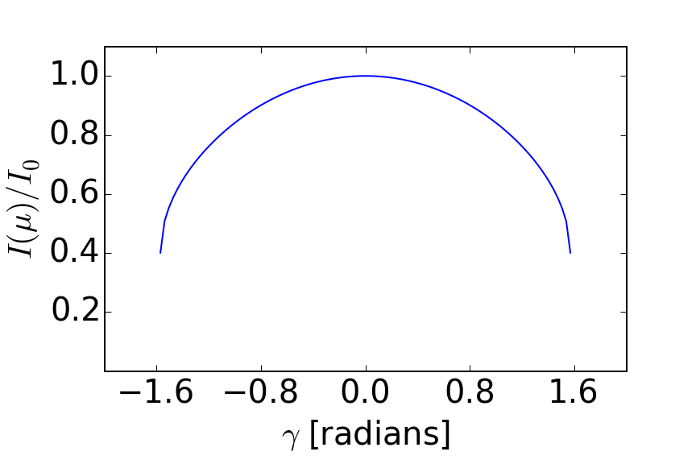
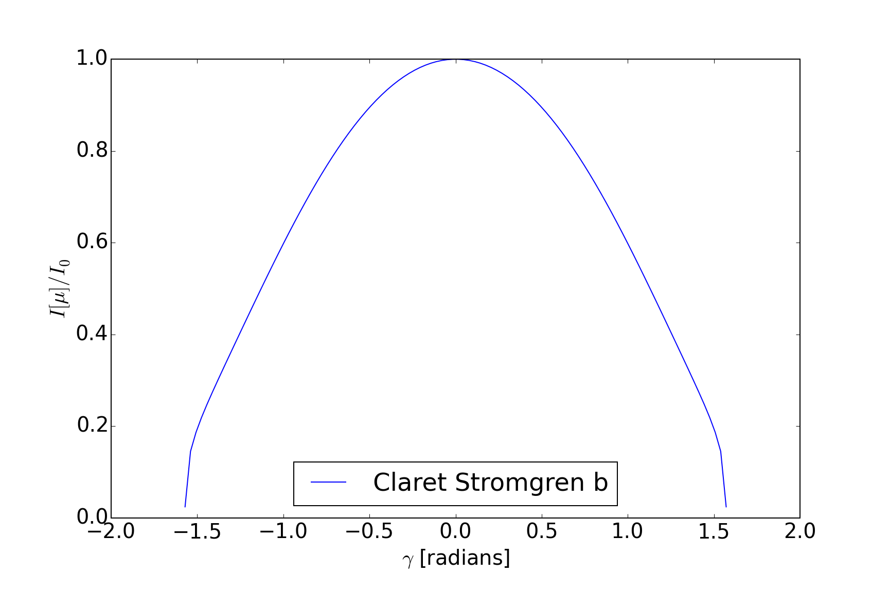

# limbDarkening
This repository contains code to create limb darkening models in Python. This code is based on the work of Claret (2000), Claret et al. (2013), or Claret et al. (2014). If you use this, be sure to cite the relevant source(s):

- [Claret (2000) A&A, 363, 1081C](http://adsabs.harvard.edu/abs/2000A%26A...363.1081C)
- [Claret et al. (2013) A&A, 552A, 16C](http://adsabs.harvard.edu/abs/2013A%26A...552A..16C)
- [Claret et al. (2014) A&A, 567A, 3C](http://adsabs.harvard.edu/abs/2014A%26A...567A...3C)

# code

All code is contained within the `code` subdirectory. Below is a description of the files within that directory, and short examples of how to use them:

##claret_most_limb_darkening.py

`claret_most_limb_darkening.py` is a routine that uses the Claret, Dragomir, Matthews (2014) MOST limb darkening model. If you use this code, please cite that paper, which can be found [here](http://adsabs.harvard.edu/abs/2014A%26A...567A...3C).

###examples

`claret_most_limb_darkening` can be used either via the command line, or by creating an object using the `LimbDarkening` class.

####command line example
    cd limbDarkening/code

To see usage help, use the --help argument:

    ./claret_most_limb_darkening --help
    usage: claret_most_limb_darkening.py [-h] teff monh logg turbvel    

    argparse object.    

    positional arguments:
      teff        The stellar effective temperature.
      monh        The stellar metalicity
      logg        The log of the stellar surface gravity
      turbvel     The stellar turbulent velocity    

    optional arguments:
      -h, --help  show this help message and exit

To get the four-parameter non-linear limb darkening coefficients:

    ./claret_most_limb_darkening 5084 -0.1 4.3 2.0
    [ 0.5989 -0.548   1.3669 -0.5722]

####object-oriented example

To create a limb darkening object within the python environment:

    from limbDarkening.code import claret_most_limb_darkening as cld
    ldo = cld.LimbDarkening(5084, 4.3, -0.1, 2.0)

To get the four-parameter non-linear limb darkening coefficients:

    ldo.get_ldcs()
    array([ 0.5989, -0.548 ,  1.3669, -0.5722])

To return the full ATLAS table as a pandas DataFrame:

    lddf = ldo.get_data()

To print the first three rows:
    
    lddf.head(3)

And to return the intensity as a function of $\gamma$, the angle between the line of sight and the outward surface normal

    ldfunc = ldo.claret_model(ldo.get_ldcs())

To plot this function over a range of $\gamma$:

    plt.rcParams['font.size']=20.
    gamma = np.linspace(-np.pi/2., np.pi/2., 1e2)
    ldfunc = ldo.claret_model(ldo.get_ldcs())
    intens = ldfunc(gamma)
    fig, ax = plt.subplots(1, 1)
    ax.plot(gamma, intens)
    ax.set_xlabel(r'$\gamma$ [radians]')
    ax.set_ylabel(r'$I(\mu)/I_0$')
    ax.set_ylim([0, 1.1])
    plt.subplots_adjust(left=0.15, right=0.9, top=0.9, bottom=0.2)
    nbins = 6
    ax.xaxis.set_major_locator(plt.MaxNLocator(nbins=nbins, prune='both'))
    ax.yaxis.set_major_locator(plt.MaxNLocator(nbins=nbins, prune='both'))



##claret_2013_limb_darkening.py

Also included in this repo is a routine for restoring info from the [Claret et al. (2013) A&A, 552A, 16C](http://adsabs.harvard.edu/abs/2013A%26A...552A..16C). If you use this code, be sure to cite their paper.

###examples

####from the command line
The four-parameter non-linear parameters can be printed by simply calling on `claret_2013_limb_darkening.py` from the command line.

To see usage of the command line interface:
```text
./claret_2013_limb_darkening.py --help
usage: claret_2013_limb_darkening.py [-h] teff logg passband

argparse object.

positional arguments:
  teff        The stellar effective temperature.
  logg        The log of the stellar surface gravity
  passband    The filter/passband

optional arguments:
  -h, --help  show this help message and exit
```

To get the coefficients for a 5084 K star with a logg of 4.3 observed in the Stromgren b band:

    ./claret_2013_limb_darkening.py 5084 4.3 b
    [ 0.85365 -1.38005  2.40726 -0.90518]

####from within python

To use the claret_2013_limb_darkening code from within the python environment:

```python
from limbDarkening.code import claret_2013_limb_darkening as cld

#make a limb darkening object
ldo = cld.LimbDarkening(5084, 4.3, 'b')

#print the coefficients
ldo.get_ldcs()
array([ 0.85365, -1.38005,  2.40726, -0.90518])

#return a function:
ldfunc = ldo.claret_model(ldo.get_ldcs())

#now make a plot:
gamma = np.linspace(-np.pi/2., np.pi/2., 1e2)
plt.plot(gamma, ldfunc_b(gamma), label='Claret Stromgren b')
plt.legend(loc='lower center')
plt.xlabel(r'$\gamma$ [radians]')
plt.ylabel(r'$I[\mu]/I_0$')

```

